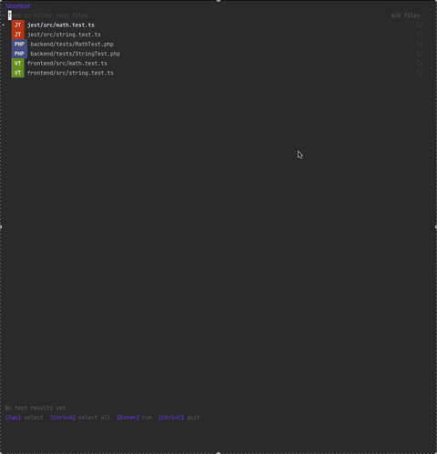

# LazyTest

A TUI test runner for **monorepos**, built with Go and [Bubble Tea](https://github.com/charmbracelet/bubbletea).

LazyTest parses [TeamCity format](https://www.jetbrains.com/help/teamcity/service-messages.html#Reporting+Tests) output in real time and displays results interactively in your terminal. Run PHPUnit, Vitest, Jest, pytest and more — side by side from a single TUI.



## Features

- **Multi-framework support** - Run PHPUnit, Vitest, and other frameworks in a single session
- **Monorepo-ready** - Configure multiple targets with separate working directories
- **Parallel execution** - Targets run concurrently, each in its own goroutine
- **Fuzzy file search** - Quickly filter and select test files across all targets
- **Target badges** - `[PHP]` / `[VT]` badges distinguish frameworks at a glance
- **Real-time streaming** - Watch test results appear as they execute
- **Split-pane results** - Browse suites/tests on the left, details on the right
- **Failure details** - View failure messages and stack traces inline
- **Re-run from results** - Press `r` to re-run without leaving the TUI
- **Editor integration** - Press `o` to open the failing test in your editor
- **Auto-detection** - Picks up `phpunit.xml` and `vitest.config.ts` automatically

## Install

```bash
go install github.com/meijin/lazytest/cmd/lazytest@latest
```

Or build from source:

```bash
git clone https://github.com/meijin/lazytest.git
cd lazytest
go build -o lazytest ./cmd/lazytest
```

## Quick Start

Run `lazytest` in any directory containing `phpunit.xml` or `vitest.config.ts`:

```bash
lazytest
```

LazyTest auto-detects test frameworks and scans for test files.

## Configuration

Create a `.lazytest.yml` in your project root:

```yaml
editor: zed
targets:
  - name: phpunit
    command: "docker compose exec app php artisan test --teamcity {files}"
    test_dirs:
      - backend/src/tests/
    file_pattern: "*Test.php"
    path_strip_prefix: "backend/src/"

  - name: vitest
    command: "npx vitest run --reporter=vitest-teamcity-reporter {files}"
    test_dirs:
      - frontend/next/src/
      - frontend/next/app/
    file_pattern: "*.test.ts,*.test.tsx"
    working_dir: "frontend/next/"
```

### Target options

| Key                | Description                                        |
|--------------------|----------------------------------------------------|
| `name`             | Target identifier. `"phpunit"` and `"vitest"` get smart defaults. |
| `command`          | Command template. `{files}` / `{file}` are replaced with test file paths. |
| `test_dirs`        | Directories to scan for test files                 |
| `file_pattern`     | Glob pattern(s) to match test files. Comma-separated for OR matching (e.g. `"*.test.ts,*.test.tsx"`). |
| `path_strip_prefix`| Prefix to strip from file paths before passing to the command |
| `working_dir`      | Working directory for the command (relative to project root). File paths are auto-adjusted. |

### Global options

| Key      | Default                      | Description           |
|----------|------------------------------|-----------------------|
| `editor` | `$LAZYTEST_EDITOR` or `zed`  | Editor for opening test files |

### Defaults by target name

| Target    | `file_pattern`         | `command`                                      | `test_dirs` |
|-----------|------------------------|------------------------------------------------|-------------|
| `phpunit` | `*Test.php`            | `./vendor/bin/phpunit --teamcity {files}`      | `tests/`    |
| `vitest`  | `*.test.ts,*.test.tsx` | `npx vitest run --reporter=teamcity {files}`   | `src/`      |

If no `.lazytest.yml` is found, LazyTest walks up to 3 directory levels to auto-detect `phpunit.xml` and `vitest.config.{ts,mts,js}`.

## Key Bindings

### Search Mode

| Key       | Action                   |
|-----------|--------------------------|
| `↑` / `Ctrl+P` | Move cursor up     |
| `↓` / `Ctrl+N` | Move cursor down   |
| `Enter`   | Run filtered tests       |
| `Ctrl+A`  | Run all tests            |
| `Tab`     | Switch to results        |
| `Ctrl+C`  | Quit                     |

### Running Mode

| Key       | Action          |
|-----------|-----------------|
| `Esc`     | Cancel run      |
| `Ctrl+C`  | Quit            |

### Results Mode

| Key       | Action                |
|-----------|-----------------------|
| `j` / `↓` | Move down            |
| `k` / `↑` | Move up              |
| `l`       | Focus detail pane     |
| `h`       | Focus list pane       |
| `r`       | Re-run same tests     |
| `R`       | Re-run all tests      |
| `f`       | Toggle failures only  |
| `o`       | Open in editor        |
| `Enter` / `Esc` | Back to search |
| `q`       | Quit                  |

## Framework Setup

LazyTest works with any test runner that outputs [TeamCity service messages](https://www.jetbrains.com/help/teamcity/service-messages.html#Reporting+Tests).

**PHPUnit** — built-in `--teamcity` flag:
```yaml
targets:
  - name: phpunit
    command: "./vendor/bin/phpunit --teamcity {files}"
```

**Vitest** — requires [vitest-teamcity-reporter](https://www.npmjs.com/package/vitest-teamcity-reporter):
```bash
npm install -D vitest-teamcity-reporter
```
```yaml
targets:
  - name: vitest
    command: "npx vitest run --reporter=vitest-teamcity-reporter {files}"
```

**Pest (PHP)**:
```yaml
targets:
  - name: pest
    command: "./vendor/bin/pest --teamcity {files}"
    file_pattern: "*Test.php"
```

**Jest** with [jest-teamcity](https://www.npmjs.com/package/jest-teamcity):
```yaml
targets:
  - name: jest
    command: "npx jest --reporters=jest-teamcity {files}"
    file_pattern: "*.test.ts"
```

**pytest** with [teamcity-messages](https://pypi.org/project/teamcity-messages/):
```yaml
targets:
  - name: pytest
    command: "python -m pytest --teamcity {files}"
    file_pattern: "test_*.py"
```

## Architecture

```
cmd/lazytest/main.go    Entry point
internal/
  config/     Configuration loading (.lazytest.yml / framework auto-detection)
  discovery/  Test file scanning (glob pattern matching, multi-target)
  domain/     Domain types (TestFile, TestRun, AggregatedRun, etc.)
  parser/     TeamCity format streaming parser
  runner/     Multi-target parallel execution (command template + goroutines)
  ui/         Bubble Tea UI (SearchMode -> RunningMode -> ResultsMode)
```

## License

MIT
